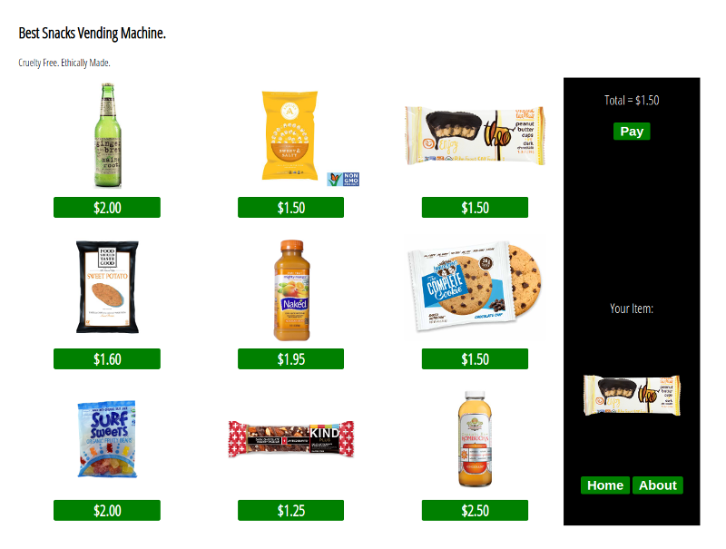
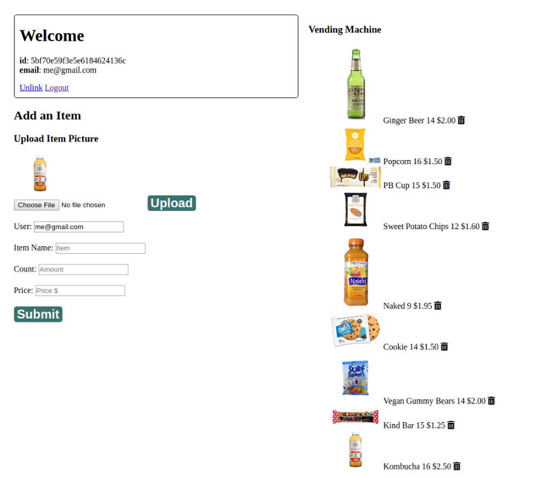

# Fullstack-Vending-Machine-App
A simple fullstack vending machine. The public see's 9 items with prices. The users click on the desired item, and pays for the item. There is then a logged in view (/login) where the vending machine owner can manage the public page item display, add new items, delete current items, see the total number of items left, items that need a refill, and how much money they have made so far.

# Public Page 

# Logged in Owner Profile Page

## How It's Made:

**Tech used:** HTML5, CSS3, JavaScript, Node.js, Mongodb, Express, EJS.

## Lessons Learned:
Used Express framework for Node.js to make get, post, put, delete http requests. Learned how to connect a Mongodb database to my application and display the data back to user with EJS (Embedded Javascript templating) that generated my HTML.

## Examples:
Fullstack Barista App
https://github.com/ericamendez/Fullstack-Barista-App

Fullstack Anime Forum
https://github.com/ericamendez/Fullstack-Anime-Forum

Complex NASA API https://github.com/ericamendez/complex-nasa-bootcamp2018c-week07