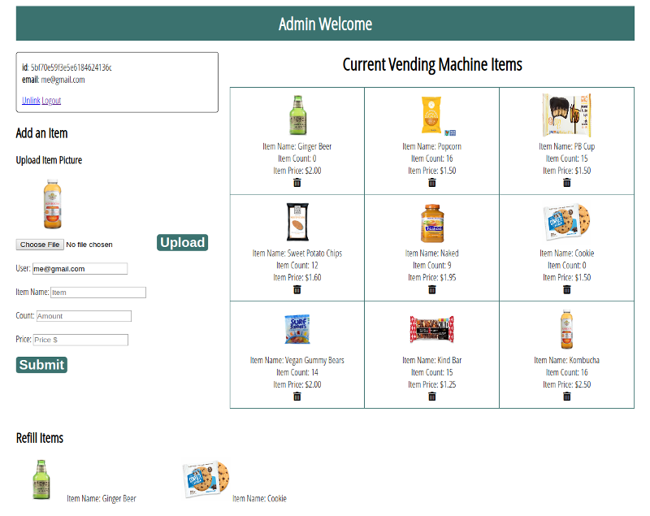

# Fullstack-Vending-Machine-App
Fullstack Vending Machine App

# Public Client Side Page 

# Logged in Administrator Profile Page

## How It's Made:

**Tech used:** HTML5, CSS3, JavaScript, Node.js, Mongodb, Express, EJS.

## Lessons Learned:
Used Express framework for Node.js to make get, post, put, delete http requests. Learned how to connect a Mongodb database to my application and display the data back to user with EJS (Embedded Javascript templating) that generated my HTML.

## Examples:
Fullstack Barista App
https://github.com/ericamendez/Fullstack-Barista-App

Fullstack Anime Forum
https://github.com/ericamendez/Fullstack-Anime-Forum

Complex NASA API https://github.com/ericamendez/complex-nasa-bootcamp2018c-week07